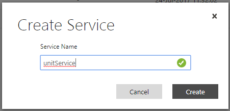
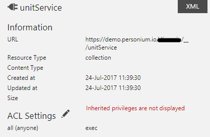
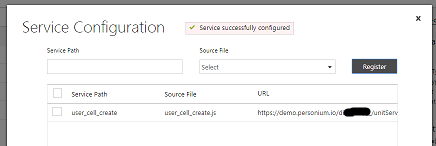

# Personal Cell Creator  
Personal Cell Creator is an adminintrative application that can only be deployed within an Unit Admin cell.  
It allows the Unit Admin cell owner/administrator to create a personal cell which belongs to the deployed environment with just one click.  

Note: Since this sample application does not implement any form of authentication, please be careful how you deploy it.  

Improved version will be released irregularly. 

## Installation    

### Prerequisites  
Before the installation, make sure you have the following information ready.  

1. A valid Personium URL   
Current implementation only support the same Personium server (deployedDomainName equals targetDomainName).    
1. A cell that host the modules (deployedCellName)  
1. A valid Unit where new cell to be created by the Personal Cell Creator.  
    1. Unit Admin Cell name (targetUnitAdminCellName)   
    1. Unit Admin account (targetUnitAdminAccountName)  
    1. Password of the Unit Admin account (targetUnitAdminAccountPassword)  

### Procedures  
Part of the following procedures required your to use the UnitManager.  

1. Perform the following procedures to install the client modules on the deployed cell.  
    1. Specify the following in [client side JavaScript](./src/js/common.js).  
        - deployedDomainName  
        - deployedCellName  
    1. Upload the following files (under src folder) to the main box of the deployed cell.  
        - create.html  
        - css/common.css  
        - js/common.js  
        - locales/en/translation.json  
        - locales/ja/translation.json  
    1. Configure the access permissions of the uploaded files.  
        1. Move inside the main box.  
        1. Click the ACL Settings edit icon (pencil) and configure the permission.  
        Assign Read privilege to the "all (anyone)" principal.  
        1. Click the Save button.  
        The following is the expected result.  
          
1. Perform the following procedures to install the engine script on the deployed cell.  
    1. Specify the following in [Engine script](./src/unitService/__src/user_cell_create.js).  
        - targetDomainName  
        - targetUnitAdminCellName  
        - targetUnitAdminAccountName  
        - targetUnitAdminAccountPassword  
    1. Create a service (unitService) in the main box of the deployed cell.  
      
    1. Upload the following files to the newly created service's __src folder.  
        - src/unitService/__src/user_cell_create.js  
    1. Configure the access permission for the service.  
        1. Move inside the main box.  
        1. Select (check mark) the service.
        1. Click the ACL Settings edit icon (pencil) and configure the permission.  
        Assign Exec privilege to the "all (anyone)" principal.  
        1. Click the Save button.  
        The following is the expected result.  
          
    1. Select the service and configure the service path to be  
        1. Move inside the main box.  
        1. Select (check mark) the service.  
        1. Click Confiugre located on the upper left of the table.  
        1. Assign the service path (user_cell_create) to the JavaScript file (user_cell_create.js).  
          
        1. Click the Register button.  
        The following is the expected result.  
          
1. The following diagram shows what the main box should look like after when Personal Cell Creator is properly deployed.   
  
1. Access the create.html file on the deployed cell.  

        {URL of the deployed cell}/__/create.html

## License

    Licensed under the Apache License, Version 2.0 (the "License");
    you may not use this file except in compliance with the License.
    You may obtain a copy of the License at

        http://www.apache.org/licenses/LICENSE-2.0

    Unless required by applicable law or agreed to in writing, software
    distributed under the License is distributed on an "AS IS" BASIS,
    WITHOUT WARRANTIES OR CONDITIONS OF ANY KIND, either express or implied.
    See the License for the specific language governing permissions and
    limitations under the License.

    Copyright 2017 FUJITSU LIMITED
